Lab 02 - Plastic waste
================
Kryschelle Fakir
2/2/2026

## Load packages and data

Here we’re loading in tidyverse and then telling R to define the dataset
for this lab as plastic_waste. This will make the data into an object
for us to access when running functions.

``` r
library(tidyverse) 
```

``` r
plastic_waste <- read.csv("data/plastic-waste.csv")
```

## Exercises

### Exercise 1

We’ll begin by looking at the distrbution of plastic waste per capita in
2010. The goal here is to understand what our data are doing and if
there are any major outliers. We will also look at the distribution by
continent using the facet_wrap function. In the second histogram plot
we’re telling R to plot the plastic waste per capita and make multiple
histograms showing the distribution for each continent.

``` r
ggplot(data = plastic_waste, aes(x = plastic_waste_per_cap)) +
  geom_histogram(binwidth = 0.2)
```

    ## Warning: Removed 51 rows containing non-finite outside the scale range
    ## (`stat_bin()`).

<!-- -->

``` r
plastic_waste %>%
  filter(plastic_waste_per_cap > 3.5)
```

    ##   code              entity     continent year gdp_per_cap plastic_waste_per_cap
    ## 1  TTO Trinidad and Tobago North America 2010    31260.91                   3.6
    ##   mismanaged_plastic_waste_per_cap mismanaged_plastic_waste coastal_pop
    ## 1                             0.19                    94066     1358433
    ##   total_pop
    ## 1   1341465

``` r
ggplot(data = plastic_waste, aes(x = plastic_waste_per_cap))+
  geom_histogram(binwidth = .35) +
  facet_wrap(~continent, nrow = 2)
```

    ## Warning: Removed 51 rows containing non-finite outside the scale range
    ## (`stat_bin()`).

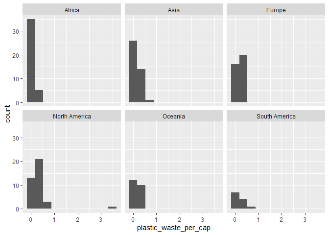<!-- -->

### Exercise 2

Now we’ll visualize the data using density plots. First, we’ll make a
basic density plots without mapping for fills. We can see the outlier a
little bit, but it’s hard to detect. Thus, we map the data by the
continent.It’s a little bit easier now but still difficult to follow.
Thus, we’ll fill in the plot by continent. This addition makes it easy
to see which continent has the most plastic waste per capita, and also
shows us the outlier in a visually appealing way. It’s still difficult
to understand with the overlapping colors, so we’ll implore the alpha
command to change the transparency.

``` r
ggplot (
  data = plastic_waste, 
  aes(x = plastic_waste_per_cap)
) + 
  geom_density()
```

    ## Warning: Removed 51 rows containing non-finite outside the scale range
    ## (`stat_density()`).

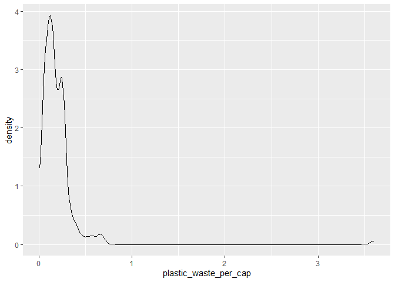<!-- -->

``` r
ggplot(
  data = plastic_waste, 
  mapping = aes(
    x = plastic_waste_per_cap, 
    color = continent
  )
) + 
  geom_density()
```

    ## Warning: Removed 51 rows containing non-finite outside the scale range
    ## (`stat_density()`).

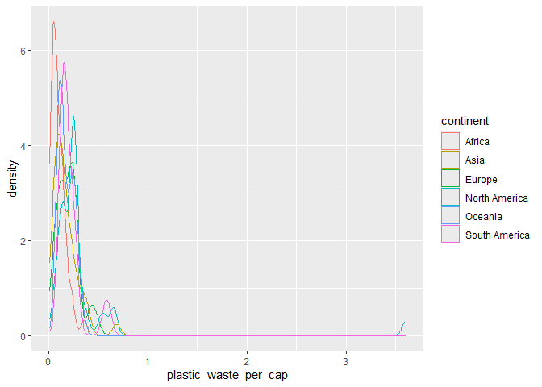<!-- -->

``` r
ggplot(
  data = plastic_waste, 
  mapping = aes(
    x = plastic_waste_per_cap, 
    color = continent, 
    fill = continent
  )
) + 
  geom_density()
```

    ## Warning: Removed 51 rows containing non-finite outside the scale range
    ## (`stat_density()`).

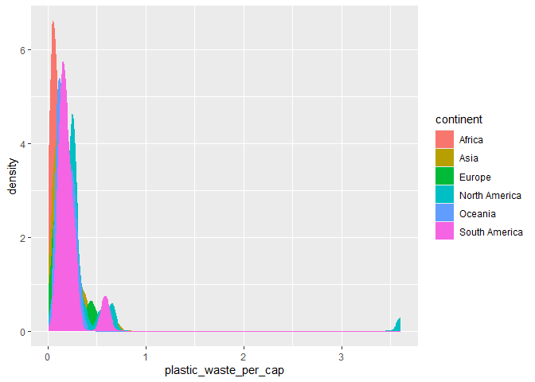<!-- -->

``` r
ggplot(
  data = plastic_waste, 
  mapping = aes(
    x = plastic_waste_per_cap, 
    color = continent, 
    fill = continent
  )
) +
  geom_density(alpha = 0.7)
```

    ## Warning: Removed 51 rows containing non-finite outside the scale range
    ## (`stat_density()`).

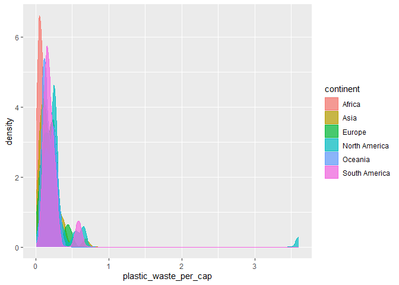<!-- -->

``` r
ggplot(
  data = plastic_waste, 
  mapping = aes(
    x = plastic_waste_per_cap, 
    color = continent, 
    fill = continent
  )
) +
  geom_density(alpha = 0.2)
```

    ## Warning: Removed 51 rows containing non-finite outside the scale range
    ## (`stat_density()`).

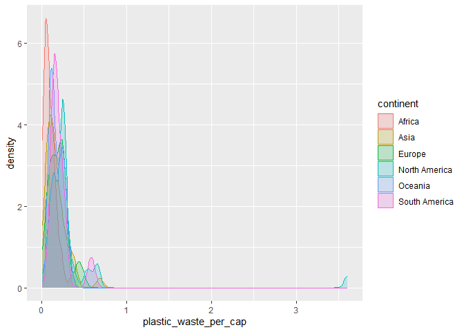<!-- -->

``` r
#If we defined the alpha level as a characteristic of the mapping aesthetics.
ggplot(
  data = plastic_waste, 
  mapping = aes(
    x = plastic_waste_per_cap, 
    color = continent, 
    fill = continent, 
    alpha = .2
  )
) +
  geom_density()
```

    ## Warning: Removed 51 rows containing non-finite outside the scale range
    ## (`stat_density()`).

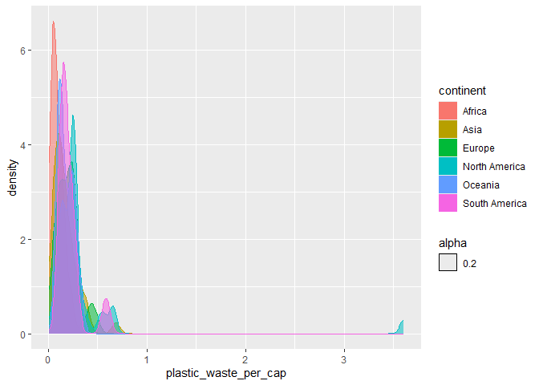<!-- -->

When adding the alpha level onto aes, the fill and the alpha are on the
same layer and, thus, R treats it like a point to plot and adds it onto
the legend. Thus, the alpha becomes another data plot, like the
continent data.

By applying the alpha level to the geom plot instead of mapping aes,
we’re essentially telling R to take the results of the density plot and
change it according to the alpha function. Now, the alpha level is a
function changing the appearance instead of functioning as a data point
to map.

Also, it seems that the alpha isn’t changing the transparency level to
the same degree when used in defining the mapping aesthetics. It could
be that the alpha level is being applied during the process, as opposed
to the look of the entire graph.

### Exercise 3

``` r
ggplot(
  data = plastic_waste, 
  mapping = aes(
    x = continent, 
    y = plastic_waste_per_cap
  )
) + 
  geom_boxplot()
```

    ## Warning: Removed 51 rows containing non-finite outside the scale range
    ## (`stat_boxplot()`).

<!-- -->

``` r
ggplot(
  data = plastic_waste, 
  mapping = aes(
    x = continent, 
    y = plastic_waste_per_cap
  )
) + 
  geom_violin()
```

    ## Warning: Removed 51 rows containing non-finite outside the scale range
    ## (`stat_ydensity()`).

<!-- -->

The violin plot shows a continuous distribution of plastic waste per
capita within the continents. These plots tell us which continents have
more or less plastic waste per capita in each category. For example,
North America has more countries with a plastic waste per capita than
Africa. As such, it shows the density of the distribution whereas the
boxplots show the exact five number distribution that some people may be
interested in knowing, such as the median and IQR. Those numbers are
harder to gauge in the violin plot than in the boxplot.

### Exercise 4

``` r
ggplot(
  data = plastic_waste, 
  mapping = aes(
    x = plastic_waste_per_cap,
    y = mismanaged_plastic_waste_per_cap
  )
) + 
  geom_point()
```

    ## Warning: Removed 51 rows containing missing values or values outside the scale range
    ## (`geom_point()`).

<!-- -->

The relationship between mismanaged plastic waste per capita and plastic
waste per capita seem highly correlated at lower levels and less so at
higher levels. Overall, the two variables are positively correlated but
that relationship is being influenced by the outliers. It seems that
some of the countries who have a higher number of mismanaged waste per
capita have smaller levels of plastic waste per capita. Thus, their
overall plastic waste per capita may be low but the plastic waste they
do have is typically high in relation to their PWPC (plastic waste per
capita). The rest of the countries’ MPWPC is porportional to their PWPC.
The outlier has high PWPC and has a relatively high, but not the
highest, MPWPC overall.

``` r
ggplot(
  data = plastic_waste, 
  mapping = aes(
    x = plastic_waste_per_cap,
    y = mismanaged_plastic_waste_per_cap, 
    color = continent
  )
) + 
  geom_point()
```

    ## Warning: Removed 51 rows containing missing values or values outside the scale range
    ## (`geom_point()`).

<!-- -->

``` r
ggplot(
  data = plastic_waste, 
  mapping = aes(
    x = plastic_waste_per_cap,
    y = mismanaged_plastic_waste_per_cap 
  )
) + 
  geom_point()+
  facet_wrap(~continent, nrow = 3, ncol = 3)
```

    ## Warning: Removed 51 rows containing missing values or values outside the scale range
    ## (`geom_point()`).

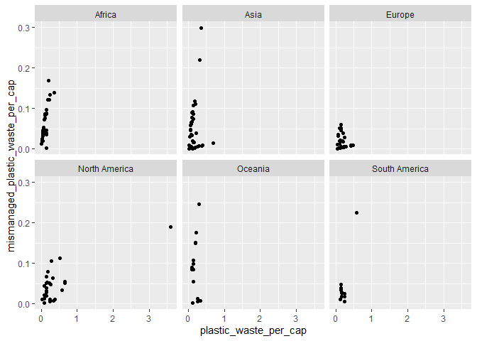<!-- -->

There are some clear distinctions between continents in the association
between MPWPC and PWPC. South America’s relationship seems much stronger
than Ocenia. Africa also has a pretty strong linear relationship where
they have less PWPC but within that PWPC their MPWPC varies but not by
much. South America and Europe’s relationship between MPWPC and PWPC
seems incredibly strong where their PWPC is low and what PWPC they have
is not that mismanaged. North America seems to have variance that is
being pulled by the outlier. Even without the outlier, there are some
differences between countries in the relationship between PWPC and
MPWPC. Overall their relationships are all going in the same direction,
with varying strengths.

``` r
ggplot(
  data = plastic_waste, 
  mapping = aes(
    x = plastic_waste_per_cap,
    y = total_pop, 
    color = continent
  )
) + 
  geom_point()
```

    ## Warning: Removed 61 rows containing missing values or values outside the scale range
    ## (`geom_point()`).

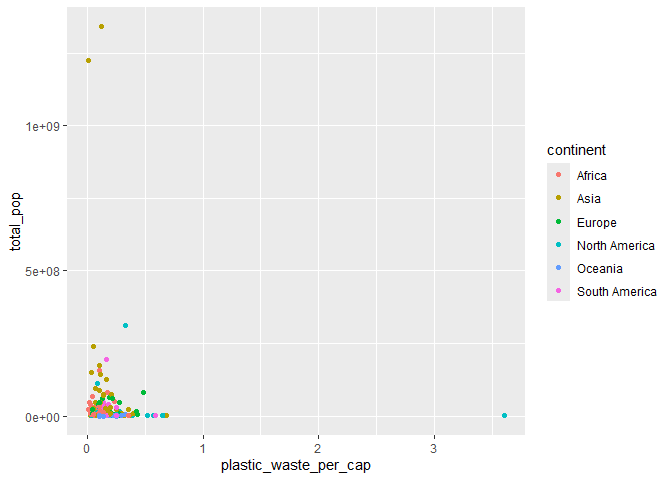<!-- -->

``` r
ggplot(
  data = plastic_waste, 
  mapping = aes(
    x = total_pop,
    y = plastic_waste_per_cap, 
    color = continent
  )
) + 
  geom_point()
```

    ## Warning: Removed 61 rows containing missing values or values outside the scale range
    ## (`geom_point()`).

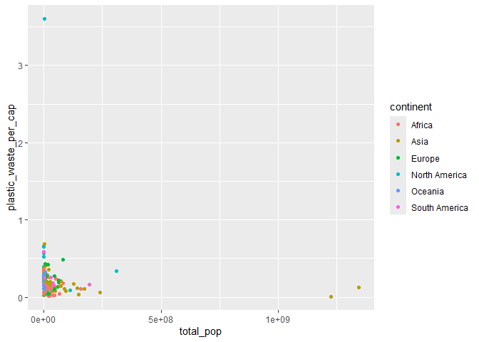<!-- -->

``` r
ggplot(
  data = plastic_waste, 
  mapping = aes(
    x = plastic_waste_per_cap,
    y = coastal_pop, 
    color = continent
  )
) + 
  geom_point()
```

    ## Warning: Removed 51 rows containing missing values or values outside the scale range
    ## (`geom_point()`).

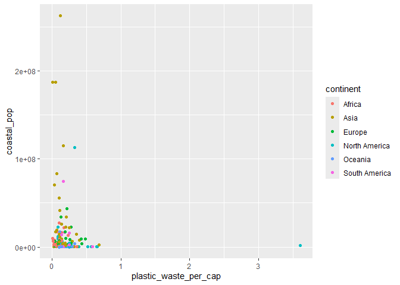<!-- -->

``` r
ggplot(
  data = plastic_waste, 
  mapping = aes(
    x = coastal_pop, 
    y = plastic_waste_per_cap,
    color = continent
  )
) + 
  geom_point()
```

    ## Warning: Removed 51 rows containing missing values or values outside the scale range
    ## (`geom_point()`).

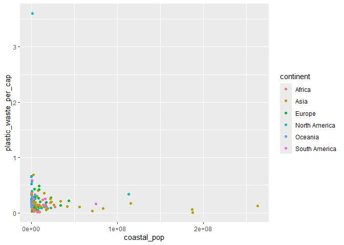<!-- -->

The relationship between PWPC and the coastal population seems to be
slightly more linearly (and negatively) associated than the relationship
between PWPC and the total population. However, I don’t think it’s a
significant difference since the shapes and density of the plots are
very similar.

### Exercise 5

Remove this text, and add your answer for Exercise 5 here.

``` r
# insert code here
```
